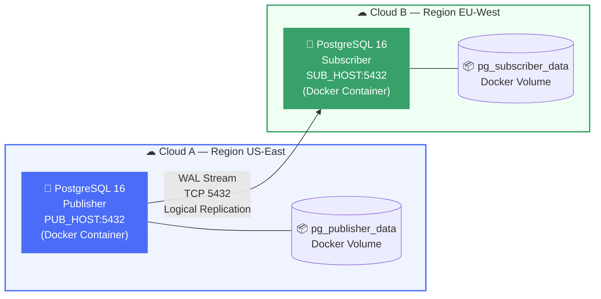
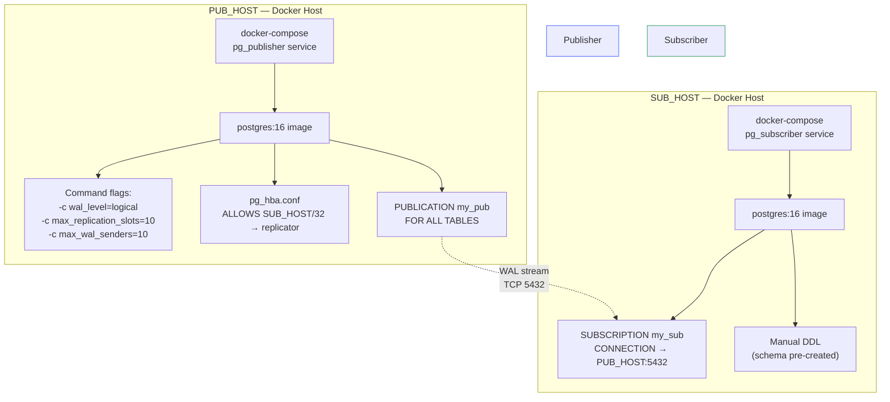
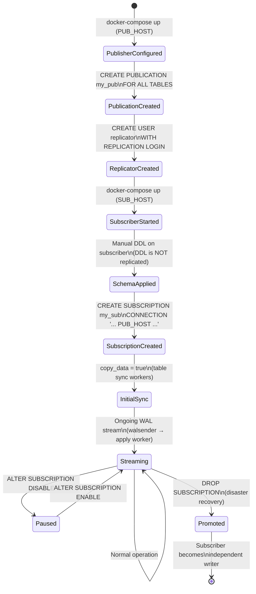
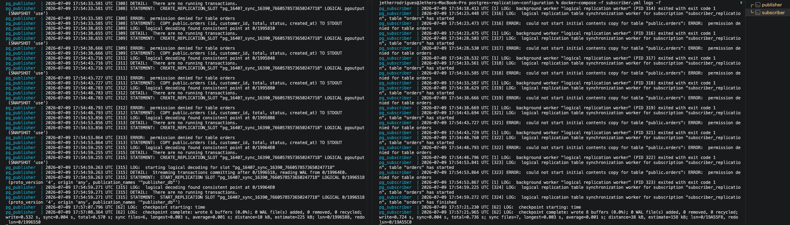

# ADR-001: PostgreSQL Logical Replication Between Cross-Cloud Docker Instances

| Field        | Value                              |
|--------------|------------------------------------|
| **ID**       | ADR-001                            |
| **Title**    | PostgreSQL Logical Replication Between Cross-Cloud Docker Instances |
| **Status**   | Accepted                           |
| **Date**     | 2026-07-09                         |
| **Authors**  | i3focus Soluções — Architecture Team |
| **Deciders** | Senior Engineering / Solutions Architecture |

---

## Context

The system requires near-real-time data synchronization between two PostgreSQL instances hosted on different cloud providers and geographic regions. The publisher node resides at `PUB_HOST` (Cloud A) and the subscriber node at `SUB_HOST` (Cloud B). Both instances run as Docker containers.

The solution must:

- Replicate row-level changes (INSERT, UPDATE, DELETE) with minimal latency
- Work across different cloud providers without a VPN tunnel (PoC scope)
- Avoid full database mirroring — only selected tables need to be replicated
- Support future promotion of the subscriber to an independent writer
- Be containerized and reproducible via `docker-compose`

Physical replication was discarded early because it requires identical PostgreSQL versions, the same OS architecture, and replicates the entire cluster — making it unsuitable for cross-cloud, cross-provider deployments.

---

## Decision

Adopt **PostgreSQL native logical replication** using the built-in publisher/subscriber model introduced in PostgreSQL 10, and deploy it via Docker containers on each host.

Each node runs an official `postgres:16` image. The publisher container is started with WAL configuration flags passed as command arguments. The subscriber connects to the publisher's public IP over TCP port 5432 using a dedicated `replicator` role.

---

## Architecture Overview



---

## Data Flow

```mermaid
sequenceDiagram
    participant APP as Application
    participant PUB as Publisher (PUB_HOST)
    participant WAL as WAL / pgoutput
    participant SLOT as Replication Slot
    participant SUB as Subscriber (SUB_HOST)

    APP->>PUB: INSERT / UPDATE / DELETE
    PUB->>WAL: Write to Write-Ahead Log
    WAL->>SLOT: Decode logical changes (pgoutput)
    SLOT-->>SUB: Stream row-level changes via walsender
    SUB->>SUB: Apply worker applies changes
    SUB-->>SLOT: Confirm flush LSN
    Note over SLOT: Slot advances; WAL segments released
```

---

## Component Diagram



---

## Replication Lifecycle



---

## Considered Alternatives

### 1. Physical / Streaming Replication

| Aspect | Assessment |
|---|---|
| Scope | Replicates entire cluster (all databases, all tables) |
| Cross-cloud | ❌ Requires same PG major version and OS architecture |
| Flexibility | ❌ Replica is read-only; no selective table replication |
| Verdict | **Rejected** — does not meet cross-cloud or selective replication requirements |

### 2. pglogical Extension

| Aspect | Assessment |
|---|---|
| Scope | Table-level, similar to native logical replication |
| DDL replication | ✅ Supported (unlike native) |
| Dependency | Requires extension install and superuser |
| Verdict | **Deferred** — viable for production if DDL replication becomes a requirement |

### 3. External CDC Tools (Debezium + Kafka)

| Aspect | Assessment |
|---|---|
| Flexibility | ✅ Very high; supports multiple consumers and transformations |
| Complexity | ❌ Requires Kafka cluster, Zookeeper/KRaft, connector management |
| Latency | Near real-time but adds broker hop |
| Verdict | **Rejected for PoC** — over-engineered for current scope; revisit for production event streaming |

### 4. pg_dump + Scheduled Restore

| Aspect | Assessment |
|---|---|
| Simplicity | ✅ Very simple to implement |
| Latency | ❌ Batch only; minutes to hours of lag |
| Consistency | ❌ No transactional guarantees during window |
| Verdict | **Rejected** — does not meet near-real-time requirement |

---

## Configuration Reference

### Publisher — `docker-compose.yml`

```yaml
services:
  pg_publisher:
    image: postgres:16
    container_name: pg_publisher
    restart: unless-stopped
    environment:
      POSTGRES_USER: postgres
      POSTGRES_PASSWORD: ${POSTGRES_PASSWORD}
      POSTGRES_DB: your_db
    ports:
      - "5432:5432"
    volumes:
      - pg_publisher_data:/var/lib/postgresql/data
      - ./pg_hba.conf:/etc/postgresql/pg_hba.conf
    command: >
      postgres
        -c wal_level=logical
        -c max_replication_slots=10
        -c max_wal_senders=10
        -c hba_file=/etc/postgresql/pg_hba.conf

volumes:
  pg_publisher_data:
```

### Publisher — `pg_hba.conf`

```
local   all   all                       trust
host    all   all       127.0.0.1/32    md5
host    all   all       ::1/128         md5
host    all   replicator  SUB_HOST/32   md5
```

### Publisher — SQL

```sql
CREATE USER replicator WITH REPLICATION LOGIN PASSWORD '${REPLICATOR_PASSWORD}';
GRANT CONNECT ON DATABASE your_db TO replicator;
GRANT USAGE ON SCHEMA public TO replicator;
GRANT SELECT ON ALL TABLES IN SCHEMA public TO replicator;

CREATE PUBLICATION my_pub FOR ALL TABLES;
```

### Subscriber — `docker-compose.yml`

```yaml
services:
  pg_subscriber:
    image: postgres:16
    container_name: pg_subscriber
    restart: unless-stopped
    environment:
      POSTGRES_USER: postgres
      POSTGRES_PASSWORD: ${POSTGRES_PASSWORD}
      POSTGRES_DB: your_db
    ports:
      - "5432:5432"
    volumes:
      - pg_subscriber_data:/var/lib/postgresql/data

volumes:
  pg_subscriber_data:
```

### Subscriber — SQL

```sql
-- 1. Create schema manually (DDL is not replicated)
CREATE TABLE orders (
  id          BIGSERIAL PRIMARY KEY,
  customer_id BIGINT,
  total       NUMERIC(12,2),
  status      TEXT,
  created_at  TIMESTAMPTZ DEFAULT now()
);

-- 2. Create subscription
CREATE SUBSCRIPTION my_sub
  CONNECTION 'host=PUB_HOST port=5432 dbname=your_db user=replicator password=${REPLICATOR_PASSWORD}'
  PUBLICATION my_pub;

  -- CREATE SUBSCRIPTION subscriber_replication
  -- CONNECTION 'host=pg_publisher port=5432 dbname=publisher_db user=replicator password=${REPLICATOR_PASSWORD}'
  -- PUBLICATION publisher_db;

-- 3. Testing the replication
INSERT INTO orders (customer_id, total, status, created_at) VALUES (1, 199.99, 'pending', now());
```

---

## Monitoring Queries

```sql
-- On PUBLISHER: check slot health and lag
SELECT slot_name, active,
       pg_size_pretty(pg_wal_lsn_diff(pg_current_wal_lsn(), confirmed_flush_lsn)) AS lag
FROM pg_replication_slots;

-- On PUBLISHER: check WAL sender
SELECT pid, usename, client_addr, state
FROM pg_stat_replication;

-- On SUBSCRIBER: check worker status
SELECT pid, received_lsn, last_msg_receipt_time
FROM pg_stat_subscription;
```



---

## Known Limitations

| Limitation | Impact | Mitigation |
|---|---|---|
| DDL not replicated | Schema changes must be applied manually on subscriber before publisher | Use a migration tool (Flyway/Liquibase) targeting both hosts |
| Sequences not replicated | Auto-increment IDs may diverge if subscriber writes independently | Use UUIDs as PKs, or set subscriber sequence offset |
| No SSL in PoC | Traffic is unencrypted over public internet | Add `sslmode=require` + certificates before production |
| Tables without PK | UPDATE/DELETE will fail | `ALTER TABLE t REPLICA IDENTITY FULL` |
| Slot WAL bloat | If subscriber goes offline, WAL accumulates indefinitely on publisher | Set `max_slot_wal_keep_size = 1GB` on publisher |

---

## Consequences

**Positive:**
- Minimal infrastructure overhead — no broker, no external dependencies
- Built into PostgreSQL 10+; no extensions required
- Subscriber can be used for read scaling or promoted independently
- Table-level granularity allows selective replication

**Negative:**
- Schema changes require a coordinated manual procedure on both sides
- No encryption in current PoC configuration
- Cross-cloud latency adds replication lag proportional to round-trip time

---

## Next Steps

- [ ] Add `sslmode=verify-full` and TLS certificates before production promotion
- [ ] Evaluate `pglogical` extension if DDL replication becomes a requirement
- [ ] Add Prometheus + `pg_stat_subscription` scraping for lag alerting
- [ ] Define RTO/RPO targets and test subscriber promotion procedure
- [ ] Consider Debezium + Kafka if fan-out to multiple consumers is needed
